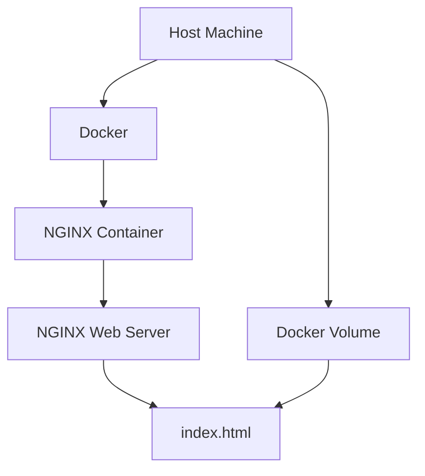

# 🚀 Docker NGINX Webserver

[](https://github.com/TheToriqul/docker-nginx-webserver)
[](https://github.com/TheToriqul/docker-nginx-webserver/stargazers)


## 📋 Overview

This project demonstrates my journey in learning how to set up and run an NGINX web server inside a Docker container. It's designed to showcase my growing skills in containerization and web server deployment. Through this project, I've gained hands-on experience with Docker and NGINX, two powerful tools in modern web development and DevOps practices.

## 🏗 Architecture



## 💻 Technical Stack

- Docker: For containerization
- NGINX: As the web server
- HTML: For static content

## ⭐ Key Features

1. Dockerized NGINX Server

   - NGINX running in an isolated container
   - Easy to deploy and manage

2. Custom Web Content

   - Serving a simple HTML file
   - Easily modifiable for learning purposes

3. Port Mapping

   - Container port exposed to host
   - Accessible via localhost

4. Volume Mounting

   - Local directory mounted for persistent storage
   - Allows for easy content updates

5. Dockerfile

   - Defines the container environment
   - Ensures consistency across deployments

6. Basic Configuration
   - Minimal setup for learning purposes
   - Foundation for more complex configurations

## 📚 My Learning Journey

### Technical Skills I've Gained:

1. Docker Basics

   - Understanding container concepts
   - Writing and using Dockerfiles
   - Managing Docker images and containers

2. NGINX Configuration

   - Basic NGINX setup in a containerized environment
   - Serving static content with NGINX

3. Networking in Docker

   - Port mapping between container and host
   - Understanding Docker networking basics

4. Volume Management

   - Using Docker volumes for persistent data
   - Mounting local directories to containers

5. Bash Scripting
   - Writing simple scripts to automate Docker commands

### Professional Growth:

1. DevOps Practices

   - Introduction to Infrastructure as Code concepts
   - Understanding the benefits of containerization

2. Documentation

   - Writing clear README files
   - Documenting setup and usage instructions

3. Version Control

   - Using Git for managing project files
   - Creating and maintaining a GitHub repository

4. Problem-solving

   - Troubleshooting container and networking issues
   - Debugging configuration problems

5. Continuous Learning
   - Researching Docker and NGINX best practices
   - Exploring official documentation and community resources

## 🔄 Future Enhancements

<details>
<summary>View Planned Improvements</summary>

1. Implement HTTPS using Let's Encrypt
2. Add custom NGINX configuration for better performance
3. Create a multi-container setup with a backend API
4. Implement logging and monitoring solutions
5. Optimize the Dockerfile for a production environment
6. Explore Docker Compose for easier management
</details>

## ⚙️ Installation

<details>
<summary>View Installation Details</summary>

### Prerequisites

- Docker installed on your system
- Git for cloning the repository

### Setup Steps

1. Clone the repository:

   ```bash
   git clone https://github.com/TheToriqul/docker-nginx-webserver.git
   cd docker-nginx-webserver
   ```

2. Build the Docker image:

   ```bash
   docker build -t my-nginx .
   ```

3. Run the container:
   ```bash
   docker run --name nginx-server -p 8080:80 -d my-nginx
   ```

### Configuration

No additional configuration is needed for basic usage.

</details>

## 🛠 Development

<details>
<summary>View Development Details</summary>

### Build Process

To rebuild the image after making changes:

```bash
docker build -t my-nginx .
```

### Testing

Test the setup by accessing `http://localhost:80` in a web browser after starting the container.

You can also use the `curl` command as mentioned in the Usage Guide to verify the server's response.

### Deployment

For local deployment, use the run command mentioned in the setup steps.

### Container Management

Use the commands listed in the Usage Guide for starting, stopping, viewing logs, and removing the container during your development process.

</details>

## 📖 Usage Guide

<details>
<summary>View Usage Details</summary>

### Basic Usage

1. After running the container, open a web browser and go to `http://localhost:80`
2. You should see the default NGINX welcome page or your custom HTML content

### Verifying the NGINX Server

To verify the container is running:

```bash
docker ps
```

This command lists all running containers. You should see **nginx-server** listed.

To verify that the NGINX server is serving your content, use:

```bash
curl http://localhost:80
```

You should see the following output (or your custom HTML content):

```html
Your custom HTML content
```

### Modifying Content

1. Edit the `index.html` file in the project directory
2. Rebuild the Docker image and run a new container to see changes

### Managing the NGINX Container

**Stopping the Container**
To stop the running NGINX container:

```bash
docker stop nginx-server
```

**Starting the Container**
To start the stopped container:

```bash
docker start nginx-server
```

**Viewing Container Logs**
To view the logs of the NGINX container:

```bash
docker logs nginx-server
```

**Removing the Container**
To remove the NGINX container, first ensure it is stopped:

```bash
docker stop nginx-server
```

Then remove the container:

```bash
docker rm nginx-server
```

</details>

## 📝 Documentation

- [Poridhi Labs](https://poridhi.io/)
- [Docker Documentation](https://docs.docker.com/)
- [NGINX Documentation](https://nginx.org/en/docs/)

## 📫 Contact

- 📧 Email: toriqul.int@gmail.com
- 📱 Phone:
  - Singapore: +65 8936 7705
  - Bangladesh: +8801765 939006

## 🔗 Project Links

- [GitHub Repository](https://github.com/TheToriqul/docker-nginx-webserver)

## 👏 Acknowledgments

I'd like to thank the Poridhi Labs, Docker and NGINX communities for their extensive documentation and tutorials which greatly aided my learning process.

---

Feel free to explore, modify, and build upon this project as part of your own learning journey. I hope my experience can help you in your path to mastering Docker and NGINX!
